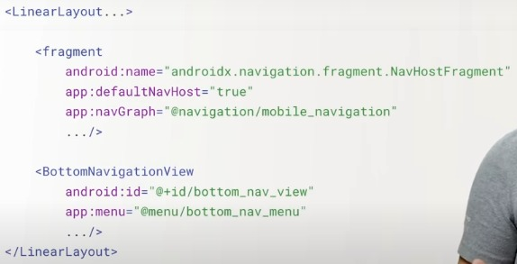

# Notes according to Google Codelabs for Android Basics in Kotlin
Part 1 . Kotlin Basics
         Layouts
         Navigation
         
Part 2 


## UNIT 1. KOTLIN BASICS
USE CASES -

Build your first Android apps with the Kotlin programming language. Add images and text to your Android apps, and learn how to use classes, objects, and conditionals to create an interactive app for your users.
Important links 
[Kotlin Playground](https://developer.android.com/training/kotlinplayground)
[Basic Vocabulary ](https://developer.android.com/courses/android-basics-kotlin/android-basics-kotlin-vocab)
[Coding conventions](https://developer.android.com/kotlin/style-guide)
[Resource Manager](https://developer.android.com/studio/write/resource-manager)

### _Quizzes_
 [1. Intro to Kotlin](https://developer.android.com/courses/quizzes/android-basics-kotlin-one/android-basics-kotlin-pathway-one?continue=https%3A%2F%2Fdeveloper.android.com%2Fcourses%2Fpathways%2Fandroid-basics-kotlin-one%23quiz-%2Fcourses%2Fquizzes%2Fandroid-basics-kotlin-one%2Fandroid-basics-kotlin-pathway-one)
[2. Android Studio and testing](https://developer.android.com/courses/quizzes/android-basics-kotlin-two/android-basics-kotlin-pathway-two?continue=https%3A%2F%2Fdeveloper.android.com%2Fcourses%2Fpathways%2Fandroid-basics-kotlin-two%23quiz-%2Fcourses%2Fquizzes%2Fandroid-basics-kotlin-two%2Fandroid-basics-kotlin-pathway-two)
[3.Basic Layou](https://developer.android.com/courses/quizzes/android-basics-kotlin-three/android-basics-kotlin-pathway-three?continue=https%3A%2F%2Fdeveloper.android.com%2Fcourses%2Fpathways%2Fandroid-basics-kotlin-three%23quiz-%2Fcourses%2Fquizzes%2Fandroid-basics-kotlin-three%2Fandroid-basics-kotlin-pathway-three)
[4. Classes, objects and conditionals](https://developer.android.com/courses/quizzes/android-basics-kotlin-four/android-basics-kotlin-pathway-four?continue=https%3A%2F%2Fdeveloper.android.com%2Fcourses%2Fpathways%2Fandroid-basics-kotlin-four%23quiz-%2Fcourses%2Fquizzes%2Fandroid-basics-kotlin-four%2Fandroid-basics-kotlin-pathway-four)

### P1. INTRODUCTION TO KOTLIN
Learn - Kotlin basic
Third CL
* Kotlin playground, hello world!! program , syntax(function, main,(),println, etc) , escape sequence 
Fourth CL
* var vs val keyword , string template ${variable}, camelCase(methods and variables, repeat loop, passing an argument to function , `printBorder(border: String)` vs Java `printBorder(String border)` , comment (single,multiple,documentation)


### P2. CREATE YOUR FIRST APP
Learn - create Android apps using Android Studio
install android studio + android test
Fouth CL
* Unit tests that run on your local machine only. These tests are compiled to run locally on the JVM to minimize execution time. located in test, tests small piece of code, runs on computer, runs directly
* Instrumentation tests usually a UI test -- part of app that depend on activity and fragments lifecycles, and platform APIs and services, don't test directly like Unit tests, 


### P3. BUILD A BASIC LAYOUT
Learn - add image and text
birthday card
* XML - ~~heirarchy of different xml components~~
  >xmlns - android , app
  
>Different ~~Options~~
* `Views`, `ViewGroups` , `TextView`, `Button`, ImageView, RecyclerView, <fragment\>, ScrollView, Switch  
  
*  Attributes applicable to most - layout_width, layout_height, layout_constraint, layout_margin , (max||min)_(height||width) , gravity, background, clickable, drawable+[Right, Left, End..] ,@colorAccent
  
## ViewGroup
Layouts - 
`LinearLayout`
`RelativeLayout`
`FrameLayout`
`GridView`
`ListView`
`Table Layout`
`Absolute Layout`
`WebView`
`ScrollView`
1. [`ConstraintLayout`](https://developer.android.com/reference/androidx/constraintlayout/widget/ConstraintLayout) 
   * `layout_constrintLeft_toLeftOf + Right Top Bottom` `layout_constrintBaseline_toBaselineOf`  `layout_margin[Start,End,Left,Top,Bottom,Baseline]`  `layout_goneMargin[Start, End, Left...]`  `layout_constraintHorizontal_bias`  `layout_constraintCircle+[ __ , Radius, Angle]`  

## Views 
EditText
Button
Image Button
Date Picker
RadioButton
CheckBox buttons
Image View

1. [TextView](https://developer.android.com/reference/kotlin/android/widget/TextView#xml-attributes)  -
    1. `contentDescription` `textAppearance` `fontFamily` eg. sans-serif-light `typeface` `textSize`  sp `lineSpacingExtra` `textColor` - black `textStyle` `textAllignment` `alpha` || text stand out - shadowColor, shadowDx, shadowDy and shadowRadius.
2. [ImageView](https://developer.android.com/reference/kotlin/android/widget/ImageView)                  
   1. `src`,`contentDescription`, `background`, `scaleType`, `adjustViewBoundary`, `cropToPadding`, `alpha` `tint`|| Resource Manager(drawable, color, layout, mipmap, navigation, animation), 
   2. Position and size - `scaleType` (`center` `centerCrop` `centerInside` `fitCenter` `fitEnd` `fitStart` `fitXY` `matrix`)
3. Buttons

---
1. Other important widgets -[Information, collection, control, hybrid](https://data-flair.training/blogs/android-widgets/)
1. Container
1. Google

> Layout Editor - Palette , Component Tree, Toolbar, Design Editor, Attributes, View Mode, Zoom and pan controls

* Chaining  - chain heads, chain style(CHAIN_+(SPREAD (+Weighted chains -Match Constraints)|| SPREAD_INSIDE || PACKED))
* dp(measure of screen) and sp(measure of text) by default both are same but resizes based on users prefered text size.
* 1 dp is 1/160thof an inch 

### P4. ADD A BUTTON TO AN APP
**Learn - use classes, objects and conditionals to create an interactive app**
`Button` `Activity` `Toast` `TextView` `if` `else` `<`  `>` `==` `Boolean` `true` `false` `when`

### _Classes and object instances_ 
* string template ${variable} , val diceRange =1..6 or 1..numSides-> IntRange type inference, diceRange.random() - [pseudo random number](https://en.wikipedia.org/wiki/Random_number_generation#Practical_applications_and_uses)
* [Class](https://play.kotlinlang.org/byExample/01_introduction/05_Classes) Name - ParkingMeter - Upper Camel Case (Pascal Casing), variable and method name(Camel Case ), accessing class property using dot notation eg. myFirstDice.sides
* Instance of a class represents an object, often a physical object eg. dice
*  return expression - return type eg. :Int
*  passing value to constructor - val numSides: Int, 
*  [Function](https://kotlinlang.org/docs/functions.html)    
    
   [Basic Syntax](https://kotlinlang.org/docs/basic-syntax.html)

   [200 side dice](https://www.wired.com/2016/05/mathematical-challenge-of-designing-the-worlds-most-complex-120-sided-dice/)

###  _Interactive Dice Roll App_
1. 
```Kotlin
   // Update the TextView with the dice roll || here text id is textView || for test only dice roll
   val resultTextView: TextView = findViewById(R.id.textView)
   resultTextView.text = dice.roll().toString() 
   ```
### _Conditional behaviour in Kotlin_
1. [`button`](https://developer.android.com/reference/android/widget/Button) 
2. `setOnClickListener{}` - lambda
   ```Kotlin
   //compresses the entre code
   button.setOnClickListener(new View.OnClickListener() {
             public void onClick(View v) {
                 // Code here executes on main thread after user presses button
             }
   }
   //to
   button.setOnClickListener{   }
   ```
3. ```Kotlin
   //toast
   val toast = Toast.makeText(this, "Dice Rolled!", Toast.LENGTH_SHORT)
   toast.show()
   ```
4. lucky no. 
   ```Kotlin
   int luckyNumber = 4
   when (rollResult) {
        luckyNumber -> println("You won!")
        1 -> println("So sorry! You rolled a 1. Try again!")
        2 -> println("Sadly, you rolled a 2. Try again!")
        3 -> println("Unfortunately, you rolled a 3. Try again!")
        5 -> println("Don't cry! You rolled a 5. Try again!")
        6 -> println("Apologies! You rolled a 6. Try again!")
   }
   ```
[Good resource for getting started with Kotlin - no opps concepts](https://developer.android.com/kotlin/first) | [when playground](https://play.kotlinlang.org/byExample/02_control_flow/01_When) | [Idioms in Kotlin](https://kotlinlang.org/docs/idioms.html#map-nullable-value-if-not-null)
### _Adding image_
* [Transparent bg image](https://www.causevox.com/blog/using-the-right-logo-image-transparent-png/#:~:text=A%20PNG%20is%20an%20image,behind%20it%20to%20show%20through.) - usually a png , gif  || use dp for images to scale appropriately on devices
* srcCompat attribute-- displayed only to the developer when building app
 ```Kotlin
   //In MainActiviy
    val rollButton: Button = findViewById(R.id.button)
    rollButton.setOnClickListener { rollDice() }
   
   // In rollDice()
   val diceImage: ImageView = findViewById(R.id.imageView)
   // Apply ~~if else~~ (repetitive) when condition to get the image resource id in drawableResource
   diceImage.setImageResource(drawableResource)
   //for screen reader to read aloud
   diceImage.contentDescription = diceRoll.toString()
   ```


### [_Unit Test_](https://developer.android.com/training/testing)
1. Why? As your app grows, manual testing takes much more effort than writing automated tests. It becomes critical when we have a large user base. (usage scenarios)faster than manual testing. more precise.
2. Add dependencies > testImplementation 'junit:junit:4.12' | test>ExampleUnitTest.kt | @Test annotation - let's compiler know the following is a test| 
3. [Assertions](https://developer.android.com/reference/junit/framework/Assert) -  eg.`assertEquals(4,2+2)` | `assertNotEquals()` `assertThat()` `assertTrue()` `assertFalse()` `assertNull()` `assertNotNull()`
   ```Kotlin
   @Test
   fun addition_isCorrect() {
       assertEquals(4, 2 + 2)
   }

   // First test | can run individual test 
   @Test
   fun generates_number() {
   val dice = Dice(6)
   val rollResult = dice.roll()
   assertTrue("The value of rollResult was not between 1 and 6", rollResult in 1..6)
   }
   ```


### _Debugging_
Use logs | error message logs(stack traces) - show function that were called leading up to the exception |research bug on your own | capture output (screenshot or GIF of running app??) | write logs using `android.util.Logger` | different log levels | search error message 

1. ```Kotlin
   private const val TAG = "MainActivity"  // private TAG so, can be declared in other classes too
   ```
2. The various single-letter methods indicate the severity of the log message. Subsequently, you can filter log messages based on both the tag and the severity, and prevent lesser-severity messages from being shown in your released application (for example).
   Diff. log levels - Log.+(e, w ,i ,d ,v )
   | Log level| Use case|
   | -| - |
   |ERROR |something went seriously wrong eg. app crashed |
   |WARN| less serever - should be fixed to avoid a serious error eg.call function that is deprecated |
   |INFO| useful information eg. operation being successfully completed|
   |DEBUG| info. that may be useful for investigating a issue - not present in builds you'd public on play store|
   |VERBOSE| least specific , can be removed after feature implementation, not included in relese build      |

   ```Kotlin
   fun logging() {
    Log.e(TAG, "ERROR: a serious error like an app crash")
    Log.w(TAG, "WARN: warns about the potential for serious errors")
    Log.i(TAG, "INFO: reporting technical information, such as an operation succeeding")
    Log.d(TAG, "DEBUG: reporting technical information useful for debugging")
    Log.v(TAG, "VERBOSE: more verbose than DEBUG logs")
   }

   // delete this , relevance ??
   Log.e(TAG,"The cake was left in the oven for too long and burned.")
   Log.w(TAG,"This oven does not heat evenly. You may want to turn the cake around halfway through to promote even browning.")
   Log.i(TAG,"The cake is ready to be served.").println("The cake has cooled.")
   Log.d(TAG,"Cake was removed from the oven after 55 minutes. Recipe calls for the cake to be removed after 50 - 60 minutes.")

   Log.v(TAG,"Put the mixing bowl on the counter.")
   Log.v(TAG, "Grabbed the eggs from the refrigerator.")
   Log.v(TAG, "Plugged in the stand mixer.")
   ```
3. No net rule for when to use each type of log level particularly for `DEBUG` `VERBOSE`.
4. Assert - filters out everything tht's `ERROR` level and below.
5. ```Kotlin
   //Infine loop       ***accessing a value that doesn't exist***
   repeat(5){
   Log.v(TAG, "${numerator / denominator--}") 
   // works in debug build , but will loop indefinitely in relese build as the log is removed
   }
   ```
6. Downloading and continuing browsing -- possible because of threads, with multiple threads you can execute multiple sequences of Kotlin code at once. Each thread has it own function stack

TODO -- finding answers on your own 
         taking screen shot


      


### Good Practices - 
1. No hardcoded string, use `@string` resource
2. Consise is better 
   ```Kotlin 
   randomNumber =(1..numSides).random() 
   return randomNumber

   // return the expression directly
   return (1..numSides).random() 
   ```
3. Add comments to your code to describ e what is happening in the code - documentation for a block of code and sigle line comments for similar statements
4. 


### _Quizzes_
 [1. Intro to Kotlin](https://developer.android.com/courses/quizzes/android-basics-kotlin-one/android-basics-kotlin-pathway-one?continue=https%3A%2F%2Fdeveloper.android.com%2Fcourses%2Fpathways%2Fandroid-basics-kotlin-one%23quiz-%2Fcourses%2Fquizzes%2Fandroid-basics-kotlin-one%2Fandroid-basics-kotlin-pathway-one)
[2. Android Studio and testing](https://developer.android.com/courses/quizzes/android-basics-kotlin-two/android-basics-kotlin-pathway-two?continue=https%3A%2F%2Fdeveloper.android.com%2Fcourses%2Fpathways%2Fandroid-basics-kotlin-two%23quiz-%2Fcourses%2Fquizzes%2Fandroid-basics-kotlin-two%2Fandroid-basics-kotlin-pathway-two)
[3.Basic Layou](https://developer.android.com/courses/quizzes/android-basics-kotlin-three/android-basics-kotlin-pathway-three?continue=https%3A%2F%2Fdeveloper.android.com%2Fcourses%2Fpathways%2Fandroid-basics-kotlin-three%23quiz-%2Fcourses%2Fquizzes%2Fandroid-basics-kotlin-three%2Fandroid-basics-kotlin-pathway-three)
[4. Classes, objects and conditionals](https://developer.android.com/courses/quizzes/android-basics-kotlin-four/android-basics-kotlin-pathway-four?continue=https%3A%2F%2Fdeveloper.android.com%2Fcourses%2Fpathways%2Fandroid-basics-kotlin-four%23quiz-%2Fcourses%2Fquizzes%2Fandroid-basics-kotlin-four%2Fandroid-basics-kotlin-pathway-four)

## **UNIT 2. LAYOUTS**
USE CASES - 

Improve the user interface of your app by learning about layouts, Material Design guidelines, and best practices for UI development.
[ONE](https://developer.android.com/courses/quizzes/android-basics-kotlin-unit-2-pathway-1/android-basics-kotlin-unit-2-pathway-1?continue=https%3A%2F%2Fdeveloper.android.com%2Fcourses%2Fpathways%2Fandroid-basics-kotlin-unit-2-pathway-1%23quiz-%2Fcourses%2Fquizzes%2Fandroid-basics-kotlin-unit-2-pathway-1%2Fandroid-basics-kotlin-unit-2-pathway-1)
[TWO](https://developer.android.com/courses/quizzes/android-basics-kotlin-unit-2-pathway-2/android-basics-kotlin-unit-2-pathway-2?continue=https%3A%2F%2Fdeveloper.android.com%2Fcourses%2Fpathways%2Fandroid-basics-kotlin-unit-2-pathway-2%23quiz-%2Fcourses%2Fquizzes%2Fandroid-basics-kotlin-unit-2-pathway-2%2Fandroid-basics-kotlin-unit-2-pathway-2)
[]()

### PATHWAY 1. GET USER INPUT IN AN APP: PART 1
Tip calculator - create layout first and implement logic to calculate the tip from the use input
### _Layout Introduction_
Draft - tip calc. and daily affirmations app

### _Tip calculator introduction_
Draft - enter information , radio button, calculate, Kotlin playground then project

### _Classes and inheritance in Kotlin_
Draft - inheritance(abstract,open, override,private), extend class , override and adding its  functionality ,visibility modifier for variables, superclass, subclass, TextView (EditView and Button), abstract class - abstract property and abstract method, primary constructor, override super property, with keyword, visibility modifier class(open), import kotlin.math library (PI) and all *,
```Kotlin
with(squareCabin) {
        println("\nSquare Cabin\n============")
        println("Capacity: ${capacity}")
        println("Material: ${buildingMaterial}")
        println("Has room? ${hasRoom()}")
    }
```

Q- importing specific file vs importing all(*)

### _Create XML Layout for Android_
Draft - `EditText` `InputType` `android:inputType` `RadioButtons` `RadioGroups` `Switch` 0dp width 


### _Calculate the tip_
Draft - `Double` `checkedRadioButtonId` `NumberFormat.getCurrencyInstance()` `%s`dynamic string `Null` | inspect code 


### PATHWAY 2. GET USER INPUT IN AN APP: PART 2
Add visual polish to the Tip Calculator app to create a better user experience

### _Changing app theme_
Draft - Material color tool, material palette generator, color.xml, Dark theme


### _Change app icon_
Draft - place file in mipmap , diff. versions of icon bitmap image (m,h,sh,xxh,xxxh)dpi , resource qualifiers - specific device eg. v26 , vector drawable, adaptive icons, image asset studio -- 
much more in Learn more


### _More polished UX_
Draft - test for edge cases, reformat code and clean up to make it concise| text feilds , selection controls switches, material icons, typography theming, gravity, make android app accessible 


### _Instrumentation tests_
Draft - create test class manually, Expresso(integral part of instrumental test)- enables interaction with UI components using code | Expresso Basics *imp.


### PATHWAY 3. DISPLAY A SCROLLABLE LIST
app with scrollable list using RecyclerView widget  | List to store data
### _Introduction_
Draft - data with list, 

### _Use Lists in Kotlin_
Draft - Lists  - sorted - reversed() ,myList.size , myList.last() , Mutable List , addAll() , `varagrs` , iterate them in while and for loop | collections , list specific operations  , this , augmented assignmens (eg.+=)

### _Use recyclerView to display a scrollable list_
Draft - learn more - Create a list with RecyclerView,RecyclerView class,RecyclerView.Adapter,RecyclerView.ViewHolder,RecyclerView library,Lists in Material Design,Enhance your UI with MaterialCardView and images | `ViewHolders` `LayoutManagers` adapters - custom viewholder class : `RecyclerView.View` class , implement `getItemCount()` , `onCreateViewHolder()` and `onBindViewHolder()`  in ItemAdapter


### _Display a list of images using cards_
Draft - list with RecyclerView , RecyclerView (class, Adapters, ViewHolder) , List and card in Material Design, Themes vs Styles, Adaptive Icons


### _Test Lists and Adapters_
Draft - 
```Kotlin
// Test the RecyclerView
onView(withId(R.id.recycler_view)).perform(
   RecyclerViewActions
       .scrollTo<RecyclerView.ViewHolder>(
           withText(R.string.affirmation10)
       )
)

onView(withText(R.string.affirmation10))
    .check(matches(isDisplayed())
)
```
Test the Adapter


### _Test the doggler app_
Draft -


## **UNIT 3. NAVIGATION**
USE CASES - 

Enhance your users’ ability to navigate across, into and back out from the various screens within your app for a consistent and predictable user experience.
[One](https://developer.android.com/courses/quizzes/android-basics-kotlin-unit-3-pathway-1/android-basics-kotlin-unit-3-pathway-1?continue=https%3A%2F%2Fdeveloper.android.com%2Fcourses%2Fpathways%2Fandroid-basics-kotlin-unit-3-pathway-1%23quiz-%2Fcourses%2Fquizzes%2Fandroid-basics-kotlin-unit-3-pathway-1%2Fandroid-basics-kotlin-unit-3-pathway-1)
[]()
[]()
[]()
[]()
[Six](https://developer.android.com/courses/quizzes/android-basics-kotlin-unit-3-pathway-5/android-basics-kotlin-unit-3-pathway-5?continue=https%3A%2F%2Fdeveloper.android.com%2Fcourses%2Fpathways%2Fandroid-basics-kotlin-unit-3-pathway-5%23quiz-%2Fcourses%2Fquizzes%2Fandroid-basics-kotlin-unit-3-pathway-5%2Fandroid-basics-kotlin-unit-3-pathway-5)
### PATHWAY 1. NAVIGATE BETWEEN SCREENS
navigate to another screen, basics of lifecycle
### _Collections in Kotlin_
Draft - 
[lamdbas](https://kotlinlang.org/docs/lambdas.html#returning-a-value-from-a-lambda-expression)(fun. without a name that can be passes as an expression immediately eg. {a:Int-> a*3}) and higher order functions(passsing a function to another function or returning a fun. from oth. fun.), 

[Collections*](https://kotlinlang.org/docs/collections-overview.html)(list, set, map) - methods to transform (forEach, map, filter, sorted [etc](https://kotlinlang.org/docs/collection-transformations.html#flatten))


### _Activities and intents_
Draft - [properties](https://kotlinlang.org/docs/properties.html#getters-and-setters), [intent, intent filters](https://developer.android.com/guide/components/intents-filters) and [commonnly used intents](https://developer.android.com/guide/components/intents-common) , 
[Options menu(XML)](https://developer.android.com/develop/ui/views/components/menus), [interfaces](https://kotlinlang.org/docs/interfaces.html) , [imp - CharSequence interface*](https://developer.android.com/reference/java/lang/CharSequence), [Null Safety](https://kotlinlang.org/docs/null-safety.html), [object Expressions and declarations, singleton pattern](https://kotlinlang.org/docs/object-declarations.html), [control flow](https://kotlinlang.org/docs/control-flow.html)


Q. Where is the singleton pattern applied?


### _Stages of the activity lifecycle_
Draft - regular +
onSaveInstanceState -> put and putInt()  | if it's null 
Data from bundle - get and getInt()

Important Questions

https://ayusch.com/android-activity-life-cycle-the-complete-guide/

https://ayusch.com/android-fragment-lifecycle-explained/

https://proandroiddev.com/the-life-cycle-of-a-view-in-android-6a2c4665b95e

https://ayusch.com/android-launch-modes-explained/

https://stackoverflow.com/questions/26728651/recyclerview-vs-listview

https://nphau.medium.com/android-mvp-vs-mvvm-key-differences-25a7e53c5262

https://betterprogramming.pub/a-detailed-story-about-handler-thread-looper-message-queue-ac2cd9be0d78

https://developer.android.com/guide/components/services

https://stuff.mit.edu/afs/sipb/project/android/docs/tools/building/index.html

https://stackoverflow.com/questions/4553605/difference-between-onstart-and-onresume

https://developer.android.com/reference/android/app/Activity#onSaveInstanceState(android.os.Bundle)

https://www.yourteaminindia.com/blog/java-vs-kotlin/

https://www.baeldung.com/java-singleton-double-checked-locking

https://stuff.mit.edu/afs/sipb/project/android/docs/guide/topics/manifest/manifest-intro.html


### PATHWAY 2. INTRODUCTION TO THE NAVIGATION COMPONENTS
Navigation Architecture Components which provides a framework for building in-app navigation
### _Introduction to navigation Components_
Draft - bottom navigation and backstack   | benefits -- backstack , automates fragment transaction, type safe argument passing , handles transition animation, simplified deep linking, visualize navi. , nav. graph(destination, actions -attributes , animations argument default values, pop behavior , launch options, destinations -- deep links  ), NavHost Fragment `findNavController().navigate(R.id.win_action)`

* Simple Button Click
* Bottom Navigation? - highlight the correct button
* Nav. Components(collection of libraries, a plugin and tooling) Benefits - (com. nav. pat. ,backstack, fragment transaction, type safe arg. pas., transi. anim. , deep linking)  | works with custom views
* Single Activity Model -WWH - One Activity and other fragments
  Navigation graph - XML file to visualize NG , paths(actions)
    actions -- ...
    destination -- Deep Links
  NavHostFragment - window that swaps out different fragment destinaitons
  NavController - Each NavHostFragment has own NavController
    ```findNavController().navigate(R.idwin_action) // will perform action based on what was in the navigation graph and swap the fragment
    // here we are using the action id . another better method is using NC's SafeArg component
    ```
* SafeArgs Plugin - generates class based on NG to ensure type-safe access to arguments for destinations and acions . add gradle plugin> generate classes bases on NG
    Directions classes for any destination which has actions
    Args classes for any destination with arguments
swap with your general code
```Kotlin
val directions: NavDirections= GameFragmentDirections.winAction()
findNavController().navigate(directions)
``` 
... 
* Navigation UI -- additional library ktx extension with support for - Options Menus, Bottom Navigation, Navigation View, Navigation Drawer and works with Action Bar, Toolbar and Collapsing Toolbar
* Add Bottom Navigation to Layout
  
* Use NavigationuI
   


### _Fragments and the Navigation component_
`Fragments` Fragment class reference `SafeArgs` `onViewCreated()` `onCreateView()` `FragmentContainerView` `NavGraph`  Null Safety Kotlin

- Adapter
  - Class - LetterViewHolder - initilization of view binding
  - getItemCount() -- returns the size of list
  - onCreateViewHolder() - returns the inflated view to the LetterViewHolder class
  - onBindViewHolder() - sets the content - 
- Fragment 
  - onCreate
  - onCreateView
  - onViewCreated
  - onDestroyView
  
  - onCreateOptionsMenu
  - chooseLayout
  - setIcon
  - onOptionsItemSelected


### _Test Navigation Components_
Draft -


### _Navigation :Overview - MAD Skills_
Draft -


### PATHWAY 3. ARCHITECTURE COMPONENTS
Jetpack Architecture components -- same as pathway 2
### _Store data in ViewModel_
Draft -


### _LiveData in ViewModel_
Draft -


### PATHWAY 4. ADVANCED NAVIGATION APP EXAMPLES
Custom back stack behaviour +(VM, data binding and Livedata)

### _Shared ViewModel_
Draft -


### _Navigation and the backstack_
Draft -


### _Test ViewModels and LiveData_
Draft -


### PATHWAY 5. ADAPTIVE LAYOUTS
Make apps adaptable to different screen sizes 
### _Two pane Layout_
Draft -


### _Adaptive Layout_
Draft -


### _Migrate your UI to responsive layouts_
Draft -


### _VM with data binding and adding navigation b/w fragments_
Draft -


